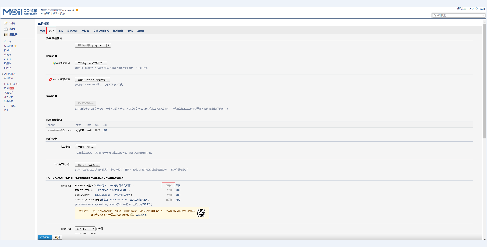

#### 一、邮箱设置

Springboot想要使用邮箱服务发送邮件需修改邮箱配置，以QQ邮箱为例

登录QQ邮箱，点击开启SMTP服务，如下图所示



这里会生成一个授权码，复制出来，配置文件里要用

#### 二、项目代码

引入maven依赖

```xml
<dependency>
	<groupId>org.springframework.boot</groupId>
	<artifactId>spring-boot-starter-mail</artifactId>
</dependency>
```

`application.properties`  配置中添加如下内容，`username` 和 `password` 要改成自己的

```shell
# 邮箱服务器地址
spring.mail.host=smtp.qq.com
# 发送方的邮箱
spring.mail.username=123456@qq.com
# 发送方的授权码，邮箱设置里面生成的授权码，这个不是真实的密码
spring.mail.password=mecjeueyzejqzuaf
spring.mail.port=465
spring.mail.protocol=smtp
spring.mail.properties.mail.smtp.auth=true
# 是否用启用加密传送的协议验证项
spring.mail.properties.mail.smtp.ssl.enable=true
spring.mail.properties.mail.smtp.starttls.required=true
# 邮件编码
spring.mail.default-encoding=UTF-8
```

定义邮件服务接口

```java
package com.rkyao.spring.boot.email.service;

/**
 * 邮件服务接口
 */
public interface MailService {

    /**
     * 发送普通纯文本邮件
     *
     * @param to 收件人地址
     * @param subject 邮件主题
     * @param text 邮件内容
     */
    void sendSimpleMail(String to, String subject, String text);

}
```

邮件服务接口实现类

```java
package com.rkyao.spring.boot.email.service.impl;

import com.rkyao.spring.boot.email.service.MailService;
import org.slf4j.Logger;
import org.slf4j.LoggerFactory;
import org.springframework.beans.factory.annotation.Autowired;
import org.springframework.beans.factory.annotation.Value;
import org.springframework.mail.SimpleMailMessage;
import org.springframework.mail.javamail.JavaMailSender;
import org.springframework.stereotype.Service;
import org.springframework.util.Assert;

/**
 * 邮件发送服务
 */
@Service
public class MailServiceImpl implements MailService {

    private Logger logger = LoggerFactory.getLogger(MailServiceImpl.class);

    @Autowired
    private JavaMailSender mailSender;

    @Value("${spring.mail.username}")
    private String senderMail;

    @Override
    public void sendSimpleMail(String to, String subject, String text) {
        Assert.hasText(to, "收件人邮箱不能为空");
        Assert.hasText(subject, "邮件主题不能为空");
        Assert.hasText(text, "邮件内容不能为空");

        SimpleMailMessage message = new SimpleMailMessage();
        message.setFrom(senderMail);   //邮件发送人
        message.setTo(to);  //邮件接收人
        message.setSubject(subject);   //邮件主题
        message.setText(text);   //邮件内容
        mailSender.send(message);
        logger.info("The mail has been sent, to: {}, subject: {}, text: {}", to, subject, text);
    }

}
```

写一个controller方法

```java
package com.rkyao.spring.boot.email.controller;

import com.rkyao.spring.boot.email.service.MailService;
import org.springframework.beans.factory.annotation.Autowired;
import org.springframework.web.bind.annotation.RequestMapping;
import org.springframework.web.bind.annotation.RestController;

/**
 * 邮件发送
 */
@RestController
@RequestMapping("/mail")
public class MailController {

    @Autowired
    private MailService mailService;

    /**
     * 发送邮件
     * localhost:8080/mail/send?to=abc@qq.com&subject=这是邮件主题&text=这是邮件内容
     *
     * @param to 收件人邮箱
     * @param subject 邮件主题
     * @param text 邮件内容
     */
    @RequestMapping("/send")
    public void send(String to, String subject, String text) {
        mailService.sendSimpleMail(to, subject, text);
    }

}
```

调用这个controller方法测试一下，收件邮箱改成实际地址，目标邮箱成功收到邮件，验证成功

localhost:8080/mail/send?to=abc@qq.com&subject=这是邮件主题&text=这是邮件内容

#### 三、GitHub源码地址

https://github.com/yaorongke/spring-boot-demos/tree/main/spring-boot-email